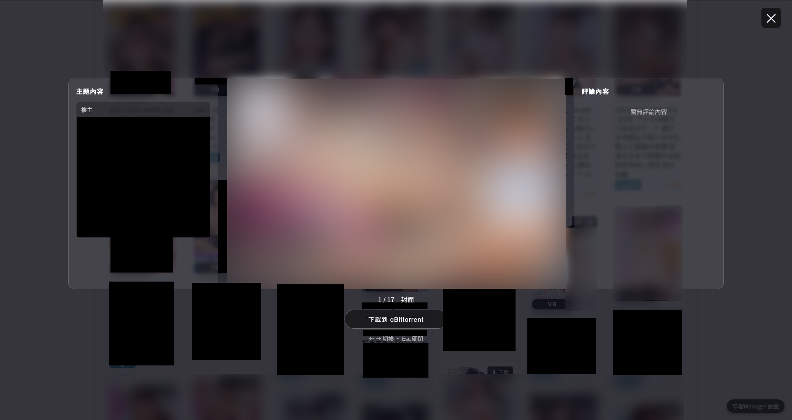

# 草榴Manager

 

**草榴Manager** 是一个用于优化特定论坛浏览体验的油猴 (Tampermonkey) 脚本。

它不仅提供了现代化的**画廊模式**来浏览帖子内的图片，还集成了强大的 **qBittorrent 一键下载**功能，支持自动解析目标下载页，直接将种子/磁力链接发送至您的下载器，并具备高级搜索、智能标签识别、下载历史记录等实用功能。

## 📢 更新日志 (Changelog)

> 2025/11/30：
> 新增：WebDAV同步方式：支持在多端进行游览、下载与各项设置同步。
> 修复：搜索结果图片加载失败、手机端滑动异常等。

> 2025/11/30：
> 新增：手机版支持
> 修复：若干问题

> 2025/11/24：
> 新增：游览历史记录
> 修复：搜索选项中的限定用戶不生效
              

> 2025/11/23：
> 修复：个别板块使用画廊功能时无法获取到全部预览图片
> 新增：画廊模式预览放大功能

> 2025/11/22：
> 新增：高级搜索：点击番号或出演者标签即可进行搜索

## ✨ 主要功能

### 1. 🚀 qBittorrent 无缝集成与下载增强
* **一键发送**：无需手动下载种子文件，脚本自动解析下载页面，将任务直接推送到您的 qBittorrent WebUI。
* **内置下载窗口**：采用悬浮窗模式加载下载页，自动尝试解析种子链接，体验更加连贯，无需频繁切换标签页。
* **多路径预设**：支持配置多个下载保存路径（标签），下载时灵活选择（例如：电影、动漫、文档）。
* **状态追踪**：自动记录已发送下载的帖子，在列表中以**绿色高亮**和“已下载”标记显示，避免重复下载。
* **连接测试**：内置 WebUI 连接性测试与详细日志面板，方便排查配置问题。

### 2. 🖼️ 沉浸式画廊 (Lightbox)
* **全屏浏览**：在帖子内使用方向键（`←` `→`）或点击图片，即可进入全屏画廊模式浏览，无需滚动翻页。
* **内容聚合**：画廊侧边栏自动提取楼主的文本介绍，并智能解析 **“出演者”**、**“类型”** 等关键信息为彩色胶囊标签。
* **详情展示**：支持渲染帖子内的详细参数表格（Tips），并自动缩放适应屏幕。
* **赞助内容恢复**：在画廊模式下智能保留并展示社区顶部的赞助商链接，不破坏页面原有信息结构。

### 3. 🔍 高级搜索与标签系统
* **高级搜索面板**：提供强大的搜索过滤器，支持限定 **版块**、**时间范围**（如1天内）、**搜索范围**（标题/内容）、**排序方式**（发布时间/热度）及 **指定作者**。
* **交互式标签**：
    * **智能解析**：自动从标题提取如 `[4K/6.5G]`、`CODE-123` 等信息生成头部标签。
    * **点击即搜**：点击帖子详情中的“出演者”名字或“番号”前缀，即可直接调用高级搜索查找该演员或系列的全部资源。

### 4. 🏷️ 列表页体验优化
* **悬停放大**：
    * **搜索页**：悬停标题即可预览封面，支持强制放大查看细节。
    * **板块页**：悬停预览图自动放大，不错过任何精彩封面。
* **封面下载**：在预览图上直接提供下载按钮，无需进入帖子即可快速添加任务。
* **画质徽章**：列表页自动识别 `4K`, `1080P`, `HDR` 等画质并显示高亮徽章。

## 📥 安装方法

1.  **安装管理器**：首先确保您的浏览器已安装 [Tampermonkey](https://www.tampermonkey.net/) (推荐) 或 Violentmonkey 扩展。
2.  **安装脚本**：
    * [点击此处安装脚本](https://raw.githubusercontent.com/truclocphung1713/CLManager/refs/heads/main/CLManager.user.js) 
    * 或者下载本项目中的 `CLManager.user.js` 文件，拖入浏览器扩展管理页进行安装。

## ⚙️ 配置指南 (qBittorrent)

脚本安装后，页面右下角会出现 **“CLManager 設置”** 悬浮按钮。点击即可打开配置面板。

### 前置要求
您需要开启 qBittorrent 的 WebUI 功能：
1.  打开 qBittorrent 软件 -> `工具` -> `选项` -> `Web UI`。
2.  勾选 `启用 Web 用户界面`。
3.  记下 **IP地址**、**端口**、**用户名** 和 **密码**。
4.  *(推荐)* 勾选 `互斥 CSRF (Cross-Site Request Forgery) 保护` 和 `启用点击劫持保护` 之外的选项，或者根据脚本提示调整。通常情况下脚本使用的 `GM_xmlhttpRequest` 可以跨域，无需特殊关闭安全选项。

### 脚本设置
在脚本设置面板中填入以下信息：
* **启用 qBittorrent 集成**：勾选。
* **WebUI 地址**：例如 `http://127.0.0.1:8080` (请勿以斜杠结尾)。
* **用户名/密码**：您的 WebUI 登录凭证。
* **储存位置预设**：您可以添加多个预设路径。
    * *名称*：显示在下载菜单中的名字（如“NAS-电影”）。
    * *SavePath*：qBittorrent 端的绝对路径（如 `D:\Downloads\Movie` 或 `/downloads/movie`）。
    * *Tags*：自动为种子打标签（可选）。

点击 **“测试连通性”** 按钮，显示绿色版本号即表示配置成功。

## 🖥️ 预览截图

## ⚠️ 免责声明

1.  本脚本仅为技术研究与交流之用，旨在提升浏览器用户体验（User Experience）。
2.  脚本作者不对用户使用本脚本访问的内容、下载的文件及其产生的后果负责。
3.  请遵守您所在国家或地区的法律法规。
4.  本脚本不存储、不传播任何非法数据，所有数据交互仅发生在用户本地浏览器与目标网站/用户自建服务之间。

## 📄 开源协议

本项目遵循 [MIT License](LICENSE) 开源协议。
